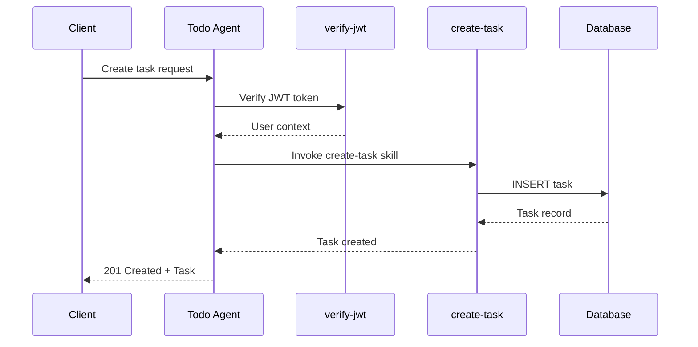
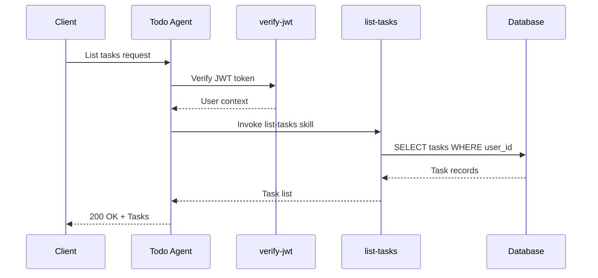
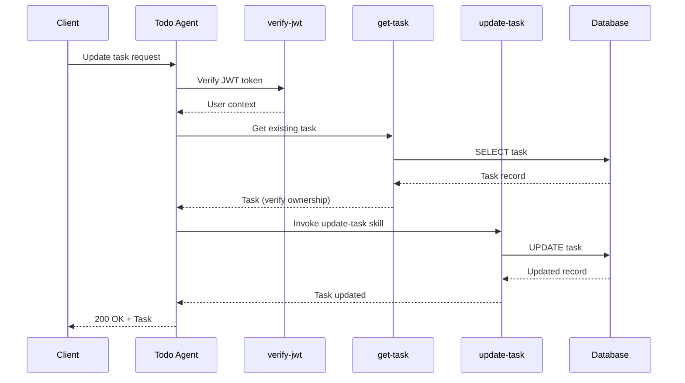
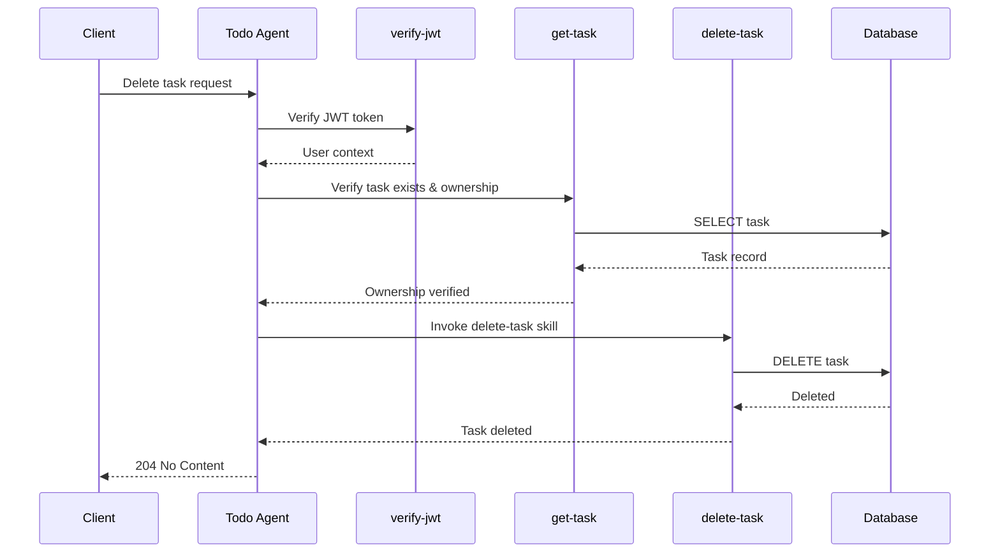

# Agent Specification: Todo Agent

> **Agent ID:** TODO-AGENT-001
> **Version:** 1.0
> **Status:** Draft
> **Last Updated:** 2025-12-10

---

## Overview

The Todo Agent is the primary orchestration agent for task management operations. It coordinates CRUD operations, manages user context, and delegates to specialized skills for atomic operations.

---

## Purpose

Enable task management operations invoked via REST API endpoints. The agent orchestrates CRUD operations and delegates to specialized skills.

---

## Capabilities

| Capability | Description |
|------------|-------------|
| Create Task | Add new tasks with title and description |
| List Tasks | Retrieve all tasks for authenticated user |
| Get Task | Retrieve single task details |
| Update Task | Modify task title and/or description |
| Delete Task | Remove task permanently |
| Toggle Complete | Mark task complete/incomplete |
| Bulk Operations | Apply operations to multiple tasks |

---

## Agent Configuration

```yaml
agent:
  id: todo-agent
  name: Todo Agent
  version: 1.0.0
  description: Task management orchestration agent

  # Authentication requirement
  requires_auth: true
  auth_method: jwt

  # Context requirements
  context:
    required:
      - user_id
      - jwt_token
    optional:
      - task_id
      - filters

  # Skills this agent can invoke
  skills:
    - create-task
    - list-tasks
    - get-task
    - update-task
    - delete-task
    - toggle-complete
    - verify-jwt

  # Rate limits
  rate_limits:
    requests_per_minute: 60
    requests_per_hour: 1000
```

---

## Subagents

### Task CRUD Subagent

Handles individual task operations.

```yaml
subagent:
  id: task-crud-subagent
  parent: todo-agent
  skills:
    - create-task
    - get-task
    - update-task
    - delete-task
```

### Task Query Subagent

Handles task listing and filtering.

```yaml
subagent:
  id: task-query-subagent
  parent: todo-agent
  skills:
    - list-tasks
    - filter-tasks
    - sort-tasks
```

### Task Status Subagent

Handles completion status changes.

```yaml
subagent:
  id: task-status-subagent
  parent: todo-agent
  skills:
    - toggle-complete
    - bulk-complete
    - bulk-incomplete
```

---

## Workflow Definitions

### Create Task Workflow



### List Tasks Workflow



### Update Task Workflow



### Delete Task Workflow



---

## Input/Output Schemas

### Agent Input

```typescript
interface TodoAgentInput {
  action: 'create' | 'list' | 'get' | 'update' | 'delete' | 'toggle';
  auth: {
    token: string;
  };
  params?: {
    task_id?: string;
    user_id?: string;
  };
  data?: {
    title?: string;
    description?: string;
    completed?: boolean;
  };
  filters?: {
    completed?: boolean;
    sort?: 'created_at' | 'updated_at' | 'title';
    order?: 'asc' | 'desc';
    limit?: number;
    offset?: number;
  };
}
```

### Agent Output

```typescript
interface TodoAgentOutput {
  success: boolean;
  action: string;
  data?: Task | Task[] | null;
  meta?: {
    count?: number;
    total?: number;
  };
  error?: {
    code: string;
    message: string;
    details?: any;
  };
}
```

---

## Error Handling

| Error Code | HTTP Status | Description | Recovery |
|------------|-------------|-------------|----------|
| `AUTH_REQUIRED` | 401 | No token provided | Prompt for authentication |
| `AUTH_INVALID` | 401 | Invalid token | Re-authenticate |
| `AUTH_EXPIRED` | 401 | Token expired | Refresh token |
| `FORBIDDEN` | 403 | User mismatch | N/A |
| `NOT_FOUND` | 404 | Task not found | Verify task ID |
| `VALIDATION` | 422 | Invalid input | Fix input data |
| `RATE_LIMITED` | 429 | Too many requests | Wait and retry |
| `SERVER_ERROR` | 500 | Internal error | Retry with backoff |

---

## Integration Points

### REST API Integration

The Todo Agent is invoked by FastAPI route handlers:

```python
from agents.todo_agent import TodoAgent

@router.post("/api/{user_id}/tasks")
async def create_task(
    user_id: UUID,
    data: TaskCreate,
    current_user: User = Depends(get_current_user)
):
    agent = TodoAgent(user=current_user)
    result = await agent.execute(
        action="create",
        data=data.dict()
    )
    return result.to_response()
```

### Event Hooks

The agent emits events for extensibility:

| Event | Trigger | Payload |
|-------|---------|---------|
| `task.created` | After task creation | Task object |
| `task.updated` | After task update | Task object, changes |
| `task.deleted` | After task deletion | Task ID |
| `task.completed` | After marking complete | Task object |
| `task.uncompleted` | After marking incomplete | Task object |

---

## Testing

### Unit Tests
- [ ] Agent correctly routes actions to skills
- [ ] Agent validates input before skill invocation
- [ ] Agent handles skill errors gracefully
- [ ] Agent enforces authentication requirement

### Integration Tests
- [ ] Create task workflow end-to-end
- [ ] List tasks workflow end-to-end
- [ ] Update task workflow end-to-end
- [ ] Delete task workflow end-to-end
- [ ] Toggle completion workflow end-to-end

---

## Related Specifications

- `/specs/features/task-crud.md` - Task CRUD feature specification
- `/specs/agents/skills/create-task.md` - Create task skill
- `/specs/agents/skills/list-tasks.md` - List tasks skill
- `/specs/agents/skills/verify-jwt.md` - JWT verification skill
- `/specs/api/rest-endpoints.md` - REST API endpoints

---

## Revision History

| Version | Date | Author | Changes |
|---------|------|--------|---------|
| 1.0 | 2025-12-10 | Claude | Initial specification |
